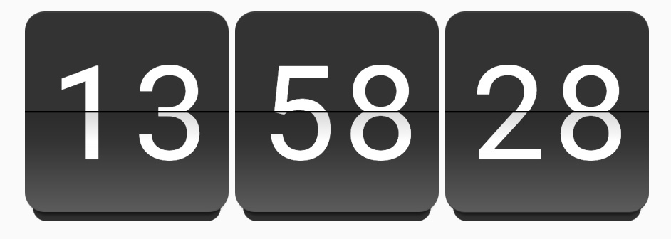
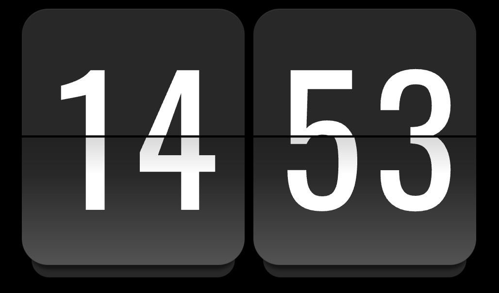

# Home Assistant Custom Card using PQINA Flip Clock



## About

Created by Tobias Wiedenmann <https://github.com/Thyraz>

Many thanks and all credits to the original creator of the PQINA flip clock @rikschennink, that made this custom card possible:
<https://github.com/pqina/flip>

If you like it, buy him a coffee, as I don't want one from you for this little card. 😉
https://buymeacoffee.com/rikschennink


## Installation

### Through HACS (recommended)

### Manual

## Configuration

The configuration is currently only possible in YAML mode, but I hope to add a GUI editor later.

### Keys / Values

#### Root Level Keys

| __Key__ | __Default__ | __Values__ | __Description__ |
|-|-|-|-|
| showSeconds | true | true / false | show or hide the third flap with the seconds |
| twentyFourHourFormat | true | true / false | 12 or 24 hour format |
| hideBackground | false | true / false | Hides the card background and border |
| styles | - | [Style Level Keys](#style-level-keys) | Options to override specific CSS settings. See the next chapter and the advanced example below. |
| tap_action | - | [action](https://www.home-assistant.io/dashboards/actions/#tap-action) | Home Assistant action. See liked docs or the advanced example below.
| entity | - | entity name | Only used when the tap_action is set to an entity-specific action like more-info. Should be omitted otherwise. |

#### Style Level Keys

| __Key__ | __Default__ | __Values__ | __Description__ |
|-|-|-|-|
| height | - | CSS size value | Height of the main card of the clock. Uses CSS size units. For example set it to a fixed 'px' value like '200px'. If you prefer a fixed aspect ratio use 'cqw' (container query width) like '30cqw', which sets the height to 30% of the width. |
| fontSize | - | CSS size value | Can also be set in different units like 'px', 'em' or 'cqw' |
| font | default theme font | font name | Font must be available in lovelace. Search the web for how to add custom fonts to HA. |
| textColor | - | CSS color value | Color of the font on the clock. Example: '#ffffff' or 'white' |
| textOffsetVertical | 0 | CSS size value | Might be needed for custom fonts when the text isn't centered vertically correctly. Best set as 'em' unit like '-0.1em' |
| frontFlapColor | - | CSS color value | Background-color of the main flaps. Example: '#333333' |
| rearFlapColor | - | CSS color value | Background-color of the flaps behind the main-flaps (shadow at the bottom). Example: '#333333' |
| frontFlapGradientOpacity | 0.2 | 0.0 - 1.0 | The main flaps have a gradient overlay (transparent to white) over the background color to add a 3d-like effect. You can adjust the opacity here |

### Minimal example

````YAML
type: custom:pqina-flip-clock-card
````

### Example with custom styling and navigation tap-action

````YAML
type: custom:pqina-flip-clock-card
twentyFourHourFormat: true
hideBackground: true
showSeconds: true
tap_action:
  action: navigate
  navigation_path: /dashboard-name/tab-name
styles:
  height: 55cqw
  textColor: rgb(255, 255, 255)
  font: Oswald
  font-size: 38cqw
  textOffsetVertical: "-0.05em"
  frontFlapColor: rgb(40, 40, 40)
  rearFlapColor: rgb(40, 40, 40)
````

